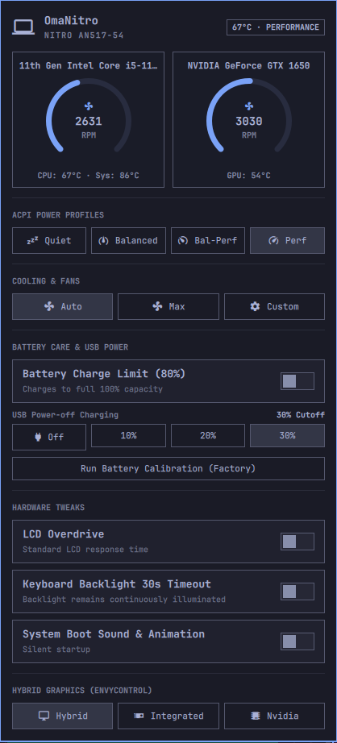

# OmaNitro

<p align="center">
  
</p>

[](LICENSE)
[]()
[-purple.svg)]()
[](https://github.com/felipeasp/linuwu-sense)

**OmaNitro** (`io.github.felipeasp.omanitro`) is a native Quickshell/QML hardware monitoring and cooling control plugin for the **Omarchy Desktop Shell**, designed specifically for **Acer Nitro 5** (e.g. AN517-54, AN515-57) and compatible Acer Nitro/Predator laptops running the [`linuwu_sense`](https://github.com/felipeasp/linuwu-sense) kernel driver.

---

## ✨ Features

- **Dual Circular Arc Telemetry Gauges:** High-precision circular gauges rendered via HTML5/QML Canvas displaying live CPU and dedicated GPU fan speeds (RPM), accompanied by real-time thermal readings (`CPU`, `GPU`, and `Motherboard/System`).
- **Dynamic Hardware Detection:** Automatically extracts real laptop model (`/sys/class/dmi/id/product_name`), CPU model name (`/proc/cpuinfo`), and dedicated GPU model (`nvidia-smi` / `lspci`). Zero hardcoded device names.
- **4 ACPI Thermal & Power Profiles:** Seamlessly switch between `Quiet`, `Balanced`, `Balanced-Performance`, and `Performance` profiles, fully synchronized with `powerprofilesctl` and ACPI platform profiles.
- **Cooling & Fan Controls:**
  - `Auto`: Dynamic fan curve managed by BIOS.
  - `Max`: Full CoolBoost fan speed (100% RPM).
  - `Custom`: Interactive dual sliders to dial in custom target percentages (0–100%) for both CPU and GPU fans.
- **Battery Health Care & USB Power:**
  - **80% Battery Limit:** Preserves long-term battery lifespan by capping maximum charge.
  - **Battery Calibration:** Triggers the factory battery calibration discharge/charge cycle.
  - **USB Power-off Charging:** Set battery cutoff thresholds (`Off`, `10%`, `20%`, `30%`) to charge external devices when the laptop is shut down.
- **Hardware Tweaks:**
  - **LCD Overdrive:** Toggles 3ms panel response time acceleration.
  - **Keyboard Backlight Timeout:** Toggles the 30-second idle backlight sleep timer.
  - **BIOS Boot Sound:** Enables or disables the startup chime and animation.
- **Hybrid Graphics (Optimus):** Quick switching between `Hybrid`, `Integrated`, and `Nvidia` graphics modes via `envycontrol`.
- **Minimalist Bar Widget:** Clean laptop icon (`󰌢`) on the taskbar with urgent-color alerting during Max fan speed, and a rich telemetry tooltip on hover.

---

## 📋 Prerequisites

1. **Linux Kernel Module (`linuwu_sense`):**
   The kernel driver must be compiled and loaded to expose the Acer WMI gaming attributes in sysfs.
   - **Recommended Fork (Modern Linux Kernels):**
     Use the patched fork maintained by [@felipeasp](https://github.com/felipeasp) with compatibility fixes for recent Linux kernel versions:
     ```bash
     git clone https://github.com/felipeasp/linuwu-sense.git
     cd linuwu-sense
     git checkout d5066fc72a197891fefe823626ee7d2da7411661
     # Follow build & installation instructions in the repository:
     make
     sudo make install
     sudo modprobe linuwu_sense
     ```
   - **Original Upstream Driver:**
     This driver is a patch and continuation of the original upstream project by [0x7375646F](https://github.com/0x7375646F) at [`https://github.com/0x7375646F/Linuwu-Sense`](https://github.com/0x7375646F/Linuwu-Sense), updated to ensure full compatibility with modern Linux kernels.
   - Verify that the driver is active:
     ```bash
     lsmod | grep linuwu_sense
     ```
2. **Polkit & `pkexec`:**
   Required for non-root execution of sysfs write commands and GPU switching.
3. **`jq`:**
   Required by the helper backend to output structured JSON telemetry.
4. **`envycontrol` (Optional):**
   Required only for hybrid GPU switching on Optimus laptops (`yay -S envycontrol`).

---

## 📦 Installation

### Recommended: Via Omarchy Plugin Store
1. Open your Omarchy App Launcher or Settings and navigate to the **Plugin Store**.
2. Search for **OmaNitro**.
3. Click **Install**.
4. Reload the shell or add the OmaNitro widget to your bar layout.

### Manual / Development Installation (User-Level)
To clone and install the user-level desktop shell plugin:
```bash
git clone https://github.com/felipeasp/omanitro.git ~/.config/omarchy/plugins/io.github.felipeasp.omanitro
cd ~/.config/omarchy/plugins/io.github.felipeasp.omanitro
./install.sh
omarchy-shell shell rescanPlugins
```

### Privileged System Installation (Polkit Rules, Helper, Systemd Service & CLI)
To enable system-wide hardware control, passwordless operation for users in the `wheel` group, systemd boot state restoration, and `/usr/bin/omarchy-omanitro`, run the dedicated privileged installer workflow:
```bash
cd ~/.config/omarchy/plugins/io.github.felipeasp.omanitro
sudo ./install-privileged.sh
```

> [!NOTE]
> For security, `install.sh` refuses to run with root privileges directly inside user-writable directories to prevent TOCTOU path reopening and mutable trust anchor attacks. Privileged installation must be executed via `install-privileged.sh`, which isolates assets in a restricted root-owned staging directory (`0700 root:root`), strictly rejects symbolic links and non-regular files, and verifies SHA-256 integrity digests on root-staged files before touching system targets.

---

## 🖥️ CLI Usage

The plugin includes a command-line interface integrated with Omarchy:

```bash
# View complete hardware status and telemetry
omarchy omanitro status

# Output telemetry in compact JSON
omarchy omanitro status --json

# Fan controls
omarchy omanitro fan auto
omarchy omanitro fan max
omarchy omanitro fan set 60 70

# ACPI thermal profiles
omarchy omanitro profile set quiet
omarchy omanitro profile set balanced
omarchy omanitro profile set balanced-performance
omarchy omanitro profile set performance

# Battery care
omarchy omanitro battery limit on
omarchy omanitro battery limit off
omarchy omanitro battery calibrate start

# USB power-off charging threshold
omarchy omanitro usb set 30

# Hardware tweaks
omarchy omanitro tweaks lcd on
omarchy omanitro tweaks backlight on
omarchy omanitro tweaks bootsound off

# GPU switching (requires envycontrol)
omarchy omanitro gpu hybrid
omarchy omanitro gpu integrated
omarchy omanitro gpu nvidia
```

---

## 🔍 Troubleshooting

### 1. Verify Kernel Module Loading
Ensure the kernel driver is active:
```bash
lsmod | grep linuwu_sense
```
If it is not loaded, load it manually:
```bash
sudo modprobe linuwu_sense
```

### 2. Verify Sysfs Nodes
OmaNitro dynamically detects either `nitro_sense` or `predator_sense` under Acer WMI platform drivers:
```bash
# Check if nitro_sense exists:
ls -la /sys/module/linuwu_sense/drivers/platform:acer-wmi/acer-wmi/nitro_sense/

# Fallback path for Predator models:
ls -la /sys/module/linuwu_sense/drivers/platform:acer-wmi/acer-wmi/predator_sense/

# Check hardware monitor sensors (fan RPM & temperatures):
ls -la /sys/module/linuwu_sense/drivers/platform:acer-wmi/acer-wmi/hwmon/hwmon*/
```

If the paths above do not exist, verify that your laptop model is supported by `linuwu_sense` and check `dmesg | grep -i acer`.

### 3. Test Backend Telemetry Directly
Run the helper script directly to inspect raw JSON output:
```bash
~/.config/omarchy/plugins/io.github.felipeasp.omanitro/scripts/nitro-helper.sh status
```

### 4. Inspect Shell Logs
To verify Omarchy shell plugin events and QML lifecycle:
```bash
journalctl --user -u omarchy-shell -f
# Or monitor general shell logs:
journalctl --since "5 minutes ago" | grep -i "omanitro"
```

---

## 🙏 Credits & Upstream Driver

- **Original Driver Author:** Special thanks to [0x7375646F](https://github.com/0x7375646F) for creating the original [`Linuwu-Sense`](https://github.com/0x7375646F/Linuwu-Sense) driver that paved the way for Acer Nitro/Predator hardware telemetry and controls on Linux.
- **Modern Kernel Fork:** Maintained and patched for newer Linux kernels by [Felipe Pires (@felipeasp)](https://github.com/felipeasp) at [`https://github.com/felipeasp/linuwu-sense`](https://github.com/felipeasp/linuwu-sense).
- **Omarchy Shell Ecosystem:** Built for the [Omarchy](https://github.com/omarchy) desktop shell environment.

---

## 📄 License

This project is licensed under the **GNU General Public License v3.0 (GPL-3.0)**. See the [LICENSE](LICENSE) file for details.
